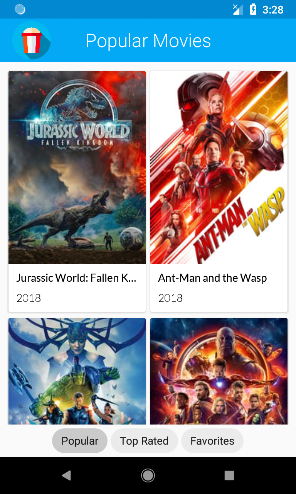
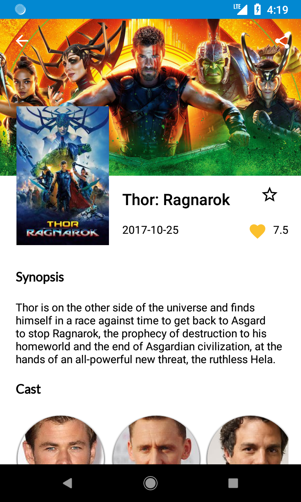
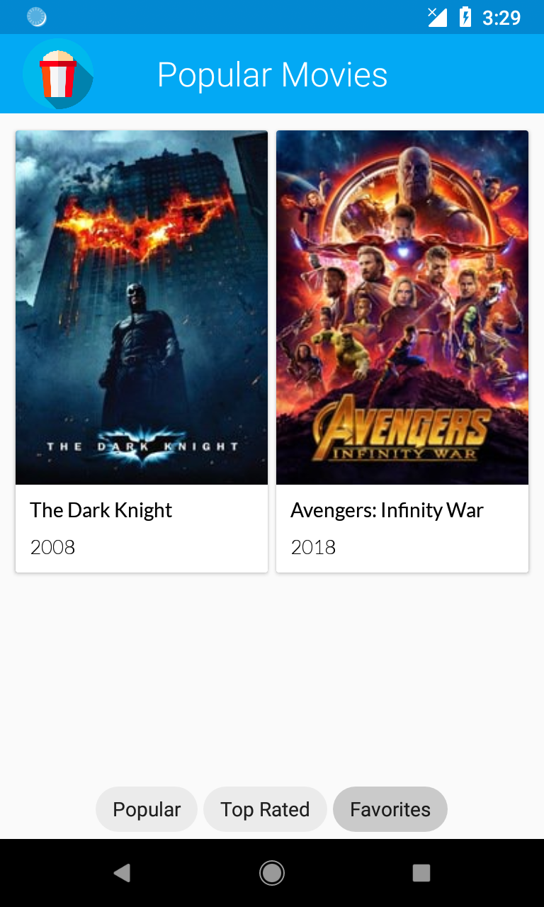
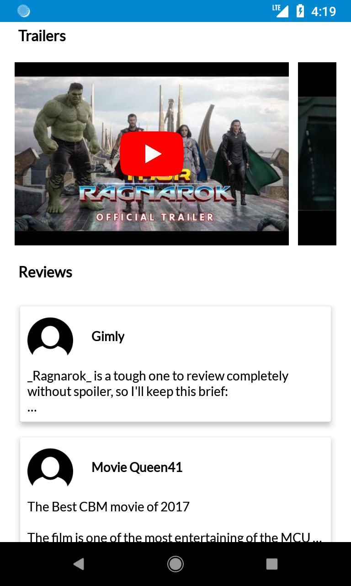

<h1 align="center">Popular Movies</h1>

This Android Application fetches Popular and Top-Rated movies from TheMovieDB API and show them in a user-friendly interface.

<a href="http://downloadinformer.com/downloads/pop-mov.apk">Download APK</a>

## Features

1. Browse Popular and Top-Rated Movies
2. Once loaded, the movie data is saved for offline access
3. Star a movie to mark it as a favorite for easy access
4. Landscape/Portrait Orientation Support

## Libraries Used

- LiveData (To observe data changes)
- ViewModel (To persist data under configuration changes)
- Room (To create and manage database)
- Volley (For network operations)
- Picasso (For loading and caching images)
- Gson (To handle JSON parsing)
- ButterKnife (To bind the views. TODO: Use DataBinding instead)

## Screenshots

Home Screen             |  Movie Detail Screen
:-------------------------:|:-------------------------:
   |  

Favorites Feature            |  Extra Movie Details
:-------------------------:|:-------------------------:
  |  

## Get Started

1. Clone and open the project.
2. Put your API_KEY in `C:\Users\<Username>\.gradle\gradle.properties` with the name `POPULAR_MOVIES_KEY`.
3. Run the project!

## Credits

- App Icon by <a href="https://www.freepik.com/">FreePik</a>
